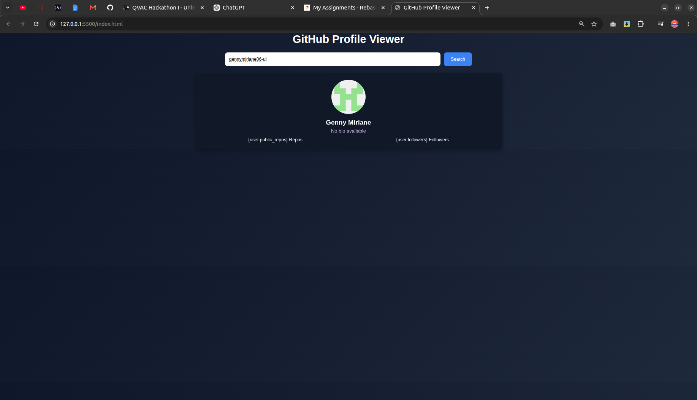

# GitHub Profile Viewer

A simple and responsive web application that allows users to search for GitHub profiles and view key account information using the GitHub API.

This project demonstrates how to work with APIs, handle asynchronous JavaScript, and dynamically update the DOM based on user input.




## Features

* Search GitHub Users
* Search for any GitHub username.
* Fetch user data directly from the GitHub API.
* Display profile information instantly.
* View Profile Details

The application displays:

  * Profile Picture (Avatar)
  * Username
  * Full Name
  * Bio
  * Location
  * Number of Repositories
  * Followers
  * Following
  * GitHub Profile Link

* Visit GitHub Profile
* Click the profile button or link to open the user's   GitHub page.
* Opens in a new tab using the `target="_blank"` attribute.

* Responsive Design

  * Works across desktop, tablet, and mobile devices.
  * Clean and user-friendly interface.
  

## Project Structure

github-profile-viewer/
├── index.html
├── style.css
└── profile.js

## Technologies Used

* HTML5
* CSS3
* JavaScript (ES6)
* GitHub REST API
* Fetch API

## How It Works

1. User enters a GitHub username.
2. The application sends a request to the GitHub API.
3. User data is retrieved and displayed on the page.
4. Clicking the GitHub profile link opens the profile in a new browser tab.

## Example Search

Search for:

```text
octocat
```

The application will display information about GitHub's famous example account.

## Learning Objectives

This project helps practice:

* Working with APIs
* Using the Fetch API
* Asynchronous JavaScript (Async/Await)
* JSON Data Handling
* DOM Manipulation
* Event Listeners
* Error Handling
* Responsive Web Design

## Future Improvements

* Search multiple users
* Repository filtering and sorting
* GitHub activity feed
* User comparison feature
* Save favorite profiles
* Advanced profile analytics

## 🧑Author

Built with using HTML, CSS, JavaScript, and the GitHub API.

Feel free to fork this project, contribute improvements, and customize it to make it your own.# GITHUB-PROFILE-VIEWER
